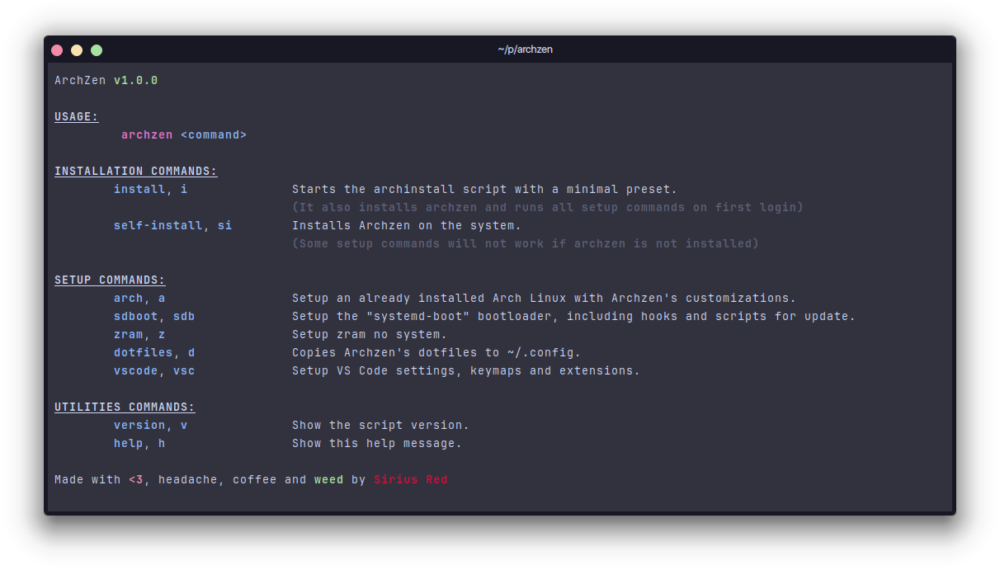

# ArchZen

My own custom Arch Linux setup in a script.

## Disclaimer

I don't intend to evolve the project beyond what it already does, its purpose is just to make my life easier when I need to format the system because I always change a lot of things, and it ends up becoming boring at times since, although I don't get paid to configure things, but to create them, I still love Arch's “DIY” way of being.

That's the only reason it's not private, as it's more practical to clone a public repository in the installation environment.

In any case, if it's useful to you, feel free to create a fork and make the edits you feel are necessary.

## Installation

In the Arch Linux live iso environment:

```bash
git clone --depth 1 https://github.com/sirius-red/archzen
cd archzen
vim archzen.sh # optional for edit default settings
./archzen.sh install
```

## CLI


